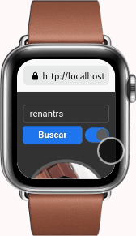

<div align="center">
    
</div>

<h1 align="center">GitHub App</h1>
<h4 align="center">This project is my third bootcamp spread challenge.</h4>

<p align="center">
  
  
  
</p>

<p align="center">
    
    
    
</p>

## About this project

This project is my third bootcamp **spread** challenge.

## How to use

To clone and run this project, you'll need **[Git](https://git-scm.com)**, **[node v14.19.3]()** or higher + **[yarn v1.22.15](https://yarnpkg.com)** or higher installed on your computer. From your command line:

```bash
#Clone this repository
$ git clone https://github.com/RenanTRS/github-app.git

#Go into the repository
$ cd github-app

#Install dependencies
$ yarn

#Run
$ yarn dev

#Test
$ yarn test
```

## Built with

- [Vite](https://vitejs.dev/guide/#scaffolding-your-first-vite-project)
- [ReactJs](https://reactjs.org/)
- [TypeScript](https://www.typescriptlang.org/)
- [styled-components](https://www.styled-components.com/)
- [Jest](https://jestjs.io/docs/getting-started)
- [Testing library](https://testing-library.com/)
- [MSW](https://mswjs.io/)
- [EsLint](https://eslint.org/)
- [Prettier](https://prettier.io/)
- [Radix Switch](https://www.radix-ui.com/docs/primitives/components/switch)
- [Phostphor Icons](https://phosphoricons.com/)

## Contact

- Email me - renantrsouza@gmail.com
- Connect with me on [LinkedIn](https://www.linkedin.com/in/renantrsouza/)

## License

This project is licensed under the MIT License - see the [LICENSE](https://github.com/renantrs/github-app/blob/main/LICENSE) file for details.
