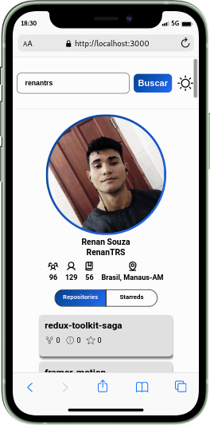
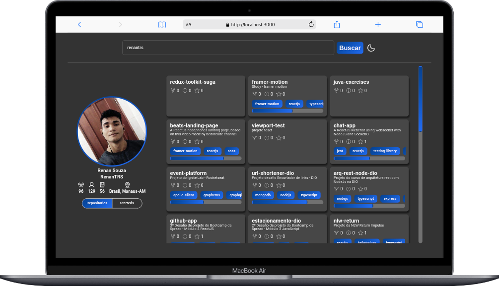

<div align="center">
    
</div>
<hr>

<p align="center">
  
  
  
  
  
  
  
</p>

<p align="center">
    
    
</p>

## About this project

This project was a bootcamp challenge.

## How to use

To clone and run this project, you'll need **[Git](https://git-scm.com)**, **[node v14.19.3]()** or higher + **[yarn v1.22.15](https://yarnpkg.com)** or higher installed on your computer. From your command line:

```bash
#Clone this repository
$ git clone https://github.com/RenanTRS/github-app.git

#Go into the repository
$ cd github-app

#Install dependencies
$ yarn

#Run
$ yarn dev

#Run unitary tests
$ yarn test

#Run e2e tests
$ yarn cypress
```

## Built with

[](https://vitejs.dev/guide/#scaffolding-your-first-vite-project)  
[](https://reactjs.org/)
[](https://www.typescriptlang.org/)
[](https://sass-lang.com/)  
[](https://v5.reactrouter.com/web/guides/quick-start)
[](https://redux.js.org/)  
[](https://jestjs.io/)
[](https://testing-library.com/)
[](https://www.cypress.io/)  
[](https://swc.rs/docs/usage/jest)
[](https://swc.rs/docs/usage/core)  
[](https://graphql.org/)
[](https://www.apollographql.com/)  
[](https://www.framer.com/motion/)
[](https://phosphoricons.com/)  
[](https://eslint.org/)
[](https://prettier.io/)  
[](https://yarnpkg.com/)

## Contact

- Email me - renantrsouza@gmail.com
- Connect with me on [LinkedIn](https://www.linkedin.com/in/renantrsouza/)

## License

This project is licensed under the MIT License - see the [LICENSE](https://github.com/renantrs/github-app/blob/main/LICENSE) file for details.
